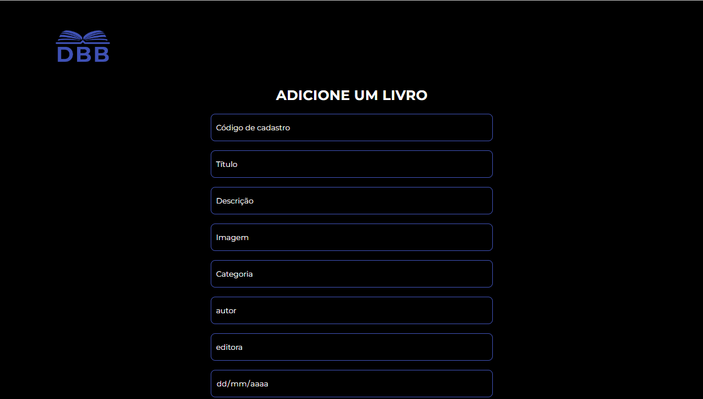

<h1 align="center">PROJETO FINAL ANGULAR - DBB</h1>

<p align="center">
  Criação e estilização de uma aplicação de uma livraria online, aonde podemos adicionar livros com suas descrições e outras informações.<br/>
</p>

<p align="center">
  <a href="#-tecnologias">Tecnologias</a>&nbsp;&nbsp;&nbsp;|&nbsp;&nbsp;&nbsp;
  <a href="#-sobre-o-projeto">Sobre o Projeto</a>&nbsp;&nbsp;&nbsp;
</p>

<p align="center">
  
</p>

## 🚀 Tecnologias

Esse projeto foi desenvolvido com as seguintes tecnologias:

- HTML 5
- CSS 3
- TypeScript
- Angular
- Node JS.

## ⚙️ Instalação do projeto

Passo-a-passo:

1. Comandos necessários para executar:

```
ng serve --open
```